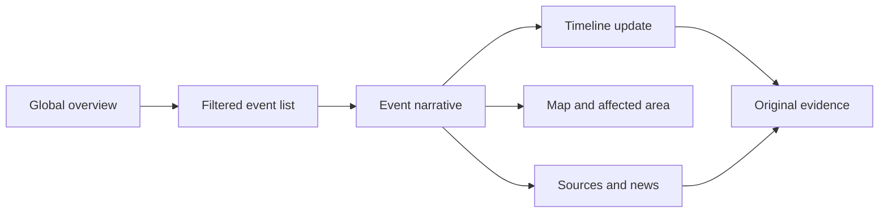

# Experience design

## Experience model

The interface is designed around a map-to-story flow, not a dashboard of configurable widgets.

Map and list always represent the same filter state. Filter state lives in the URL so a view can be shared. A public visitor never encounters a sign-in wall.

## Public platform

### Global overview

The first screen contains:

- a compact product header with search, “About the data,” and accessibility controls;
- a source-health strip that appears only for stale or degraded coverage;
- a synchronized event list and world map;
- filters for event type, system priority, lifecycle, time window, and region;
- an “updated at” value and a short explanation of what qualifies as active;
- list-first behavior on small screens, with the map opened as a full-screen secondary view.

The default list is ranked deterministically by public priority, recency of meaningful change, confidence, and geographic relevance if the user opts into location. News volume is not a proxy for severity.

### Event card

Each card shows only decision-relevant information: event type, concise title, place, lifecycle, source severity if supplied, system priority, confidence label, latest material change, last verified time, and number of independent sources. Color is reinforced by text and iconography.

### Event page

The public event page is a single narrative with anchored sections rather than a collection of tabs:

1. **Header:** type, place, status, occurred/started time, last verified time, confidence, and official-source badges.
2. **What we know:** compact verified facts with inline citations.
3. **Situation report:** beginning, current situation, impact, response, and outlook, each with an as-of timestamp.
4. **Map:** event geometry, track or affected area where available, and an accessible text alternative.
5. **Timeline:** meaningful changes in chronological order, grouped by day when dense.
6. **News and updates:** linked headlines and excerpts, ranked by source quality, freshness, and corroboration.
7. **Sources and methodology:** source list, last successful checks, known gaps, and report revision history.

Predicted, preliminary, automatic, confirmed, and manually verified content must use distinct labels. Conflicting figures are shown side by side with their dates and sources; they are not averaged.

### Search

Search covers event titles, places, event types, report text, and source headlines using PostgreSQL full-text search plus trigram matching. Results disclose whether the match came from an event, update, or article. Semantic search is deferred until ordinary search is demonstrably insufficient.

## Administration portal

The administration shell is visually related but structurally separate under `/admin`. Its primary navigation is:

- Review queue
- Events
- Reports
- Sources
- System health
- Audit log

### Review queue

This is the administrator's home. It groups work by reason rather than by backend job:

- possible duplicate or ambiguous correlation;
- new high-priority event;
- material source change;
- conflicting impact figures;
- draft report awaiting review;
- stale source or repeated adapter failure;
- content flagged for correction.

Every item states why it needs attention and the safest next action. Bulk publishing is intentionally absent from the MVP.

### Event workspace

The workspace uses a three-part desktop layout and a stacked mobile layout:

- evidence and source history;
- canonical event facts, geometry, and timeline;
- publication panel with validation errors, preview, and publish controls.

Administrators can link/unlink evidence, merge or split events, edit facts, suppress an incorrect observation without deleting it, add a manual source URL, create timeline entries, compare report revisions, and publish or unpublish. All material actions require a reason and create an audit record.

### Report editor

The editor is structured by report section. Generated text is a draft, and each paragraph displays its supporting evidence. An administrator can regenerate one section without replacing hand-edited sections. Publishing is blocked when a factual paragraph lacks a citation or references suppressed evidence.

## Interaction rules

- Public data queries use TanStack Query with server-provided cache validators.
- Mutations are admin-only, optimistic only for reversible local state, and reconciled with server revisions.
- Zustand stores ephemeral UI state such as panel size, map viewport, and local preferences. Server data never lives in a global client store.
- Destructive editorial actions use explicit confirmation and a typed reason, with an undo path where feasible.
- Loading states preserve layout; empty, stale, partial, and failed states are visually different.
- Maps never trap keyboard or scroll input. “View as list” and geometry descriptions are always available.

## Visual direction

The visual character is calm, precise, and editorial rather than military or alarmist.

- Neutral slate surfaces with one restrained geographic accent.
- Hazard colors are reserved for data meaning and never become decoration.
- Typography favors highly legible variable sans text with tabular numerals for metrics and timestamps.
- Cards use subtle borders and limited elevation; density is reduced on public pages and higher in admin review views.
- Motion communicates state change and respects `prefers-reduced-motion`.
- Dark mode is supported, but map styles are selected for contrast and legible attribution in both themes.

Exact tokens, typography, icon set, and logo are decided in the foundation design sprint after the working name passes review. No private predecessor visual assets or tokens are reused.

## Accessibility acceptance criteria

- WCAG 2.2 AA is the release target.
- Every flow works with keyboard only at 200% zoom.
- Focus is visible, logical, and restored after dialogs and route transitions.
- All controls have programmatic names; status is never communicated by color alone.
- Map information has a table/list equivalent and textual geometry summary.
- Timeline markup is semantic and timestamps use machine-readable `datetime` values.
- Automated axe checks, component accessibility tests, and manual screen-reader passes are release gates.

## States that must be designed before implementation

For overview, event, queue, workspace, and source-health screens, design and review: first load, cached load, empty result, stale data, partial source outage, permission denied, validation failure, conflict, successful publish, narrow mobile, keyboard focus, dark mode, and 200% zoom.
