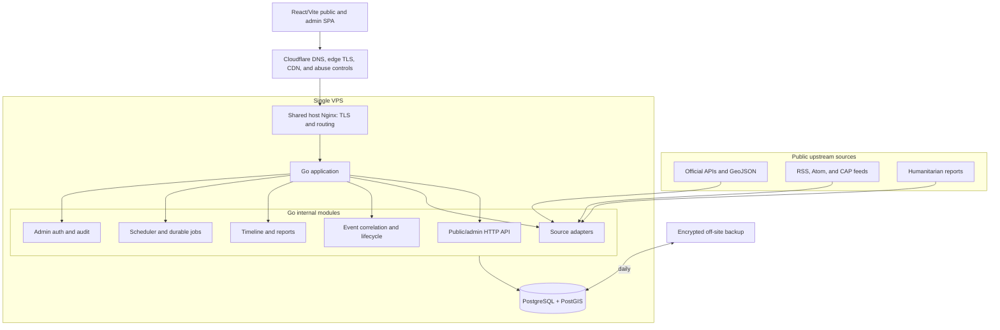

# System architecture

## Architectural choice

Atlas is a modular monolith: one Go codebase and deployable process with strongly separated internal modules. It gives a solo maintainer transactional consistency and simple operations without abandoning boundaries that could later be extracted.



The Vite build is copied into the distroless Go image during the multi-stage build. The Go process serves immutable assets, SPA fallbacks, and APIs. Cloudflare reaches the shared host Nginx through proxied A records; Nginx provides origin TLS and forwards only to the loopback-bound Atlas port. The database remains private. A separate worker process can be started from the same image only when load measurements justify it; it is not a different service or repository.

## Complexity budget

The core production profile permits:

- one Go application process;
- one PostgreSQL/PostGIS database;
- one virtual host on the VPS's existing Nginx;
- local durable storage plus one off-site backup target;
- external connections only to configured sources, optional map tiles, and an optional report model.

Adding Redis, a message broker, a vector database, a headless browser, an additional runtime, or a separately deployed service requires an ADR with measured evidence that Postgres and the monolith cannot meet the need.

## Go stack

- Go 1.26, tracking the latest supported patch release.
- `net/http` with `chi` for routing and middleware.
- checked-in OpenAPI 3.1 with a generated TypeScript SDK and explicit Go handlers.
- `pgx` and `sqlc` for typed database access.
- Goose for forward-only SQL migrations.
- Standard `log/slog` JSON logging.
- Prometheus-format metrics through a small `/metrics` endpoint.
- OpenTelemetry propagation points, with export disabled by default.
- Argon2id password hashing and secure database-backed sessions for administrators.

Exact dependency versions are pinned during foundation work after compatibility tests. Standard-library solutions are preferred when they remain clear and testable.

## Module boundaries

| Module | Owns | May depend on |
|---|---|---|
| `source` | source definitions, fetch runs, raw payload metadata, health | platform primitives |
| `observation` | normalization and append-only source observations | source, geo primitives |
| `event` | canonical events, aliases, revisions, correlation, lifecycle | observation, geo |
| `editorial` | timeline entries, articles, report drafts/versions, publication | event, observation |
| `jobs` | durable jobs, leases, retry policy, schedule definitions | platform primitives |
| `identity` | administrators, sessions, CSRF, rate limits | platform primitives |
| `audit` | immutable administrative action log | identity, platform primitives |
| `publicapi` | read models and cache validators | event, editorial, source health |
| `adminapi` | commands and review queues | all domain modules through interfaces |

Modules do not issue SQL against another module's tables. Cross-module updates use explicit application services inside one transaction. Public HTTP handlers never call source adapters directly.

## Source ingestion contract

Each adapter implements three narrow operations:

```go
type Adapter interface {
    Key() string
    Fetch(ctx context.Context, cursor Cursor) (FetchResult, error)
    Decode(ctx context.Context, item FetchedItem) ([]Candidate, error)
}

type Normalizer interface {
    Normalize(ctx context.Context, candidate Candidate) (Observation, error)
}
```

`Fetch` handles HTTP, conditional requests, pagination, and source-specific rate limits. `Decode` validates the source representation. `Normalize` maps a candidate to the platform taxonomy without network access. Tests keep raw fixtures so parsing changes are reproducible.

One database transaction records a fetch run, immutable observation/version, and durable downstream jobs. A successful fetch with zero items is distinct from a failed fetch. Raw payload bodies are retained according to source license and storage policy; otherwise a hash, selected fields, and original URL are retained.

## Durable jobs without a broker

The `jobs` table stores job type, JSON payload, idempotency key, state, attempt count, availability time, lease owner, lease expiry, and last error. Workers claim jobs using `FOR UPDATE SKIP LOCKED`. Job creation occurs in the same transaction as the domain change that requires it.

Rules:

- every handler is idempotent;
- retries use exponential backoff with jitter and a maximum attempt count;
- leases have heartbeats and expire after worker loss;
- poison jobs remain visible and replayable;
- scheduled source jobs use PostgreSQL advisory locks to ensure a single leader;
- source failures are isolated by adapter and circuit-broken after a configurable streak;
- no event becomes less severe merely because a job or upstream request failed.

## Read path

Public event summaries are ordinary indexed SQL read models. Responses include strong ETags, `Last-Modified`, a generated-at timestamp, and source-coverage state. Cloudflare and browser caches may revalidate them. The last published event/report remains available during ingestion failures.

High-traffic read models can later use PostgreSQL materialized views refreshed after publication. Redis is not the default answer.

## API shape

Public endpoints are versioned under `/api/v1` and read-only:

- `GET /events`
- `GET /events/{slug}`
- `GET /events/{slug}/timeline`
- `GET /events/{slug}/sources`
- `GET /search`
- `GET /coverage`
- `GET /meta`

Admin endpoints use resource revisions for optimistic concurrency and CSRF-protected cookie sessions:

- `POST /admin/session`, `DELETE /admin/session`
- `GET /admin/review-items`
- `PATCH /admin/events/{id}`
- `POST /admin/events/{id}/merge`
- `POST /admin/events/{id}/split`
- `POST /admin/events/{id}/timeline`
- `POST /admin/events/{id}/reports/draft`
- `POST /admin/reports/{id}/publish`
- `GET /admin/sources`, `POST /admin/sources/{key}/run`
- `GET /admin/audit`

OpenAPI is generated from server definitions, and the frontend client is generated from the checked-in specification. API-breaking changes are caught in CI.

## Extraction criteria

A module becomes a service only if all are true:

1. profiling shows independent scaling is necessary;
2. its data ownership and API are already stable;
3. transactional coupling is acceptably replaced by an outbox/inbox protocol;
4. the operational cost is documented and affordable;
5. failure injection shows extraction improves, rather than reduces, reliability.

Population exposure is the most likely optional service because its dataset footprint can be isolated. It is not on the synchronous event-ingestion path.
