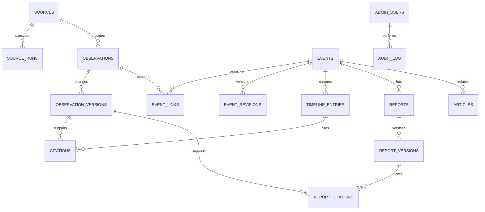
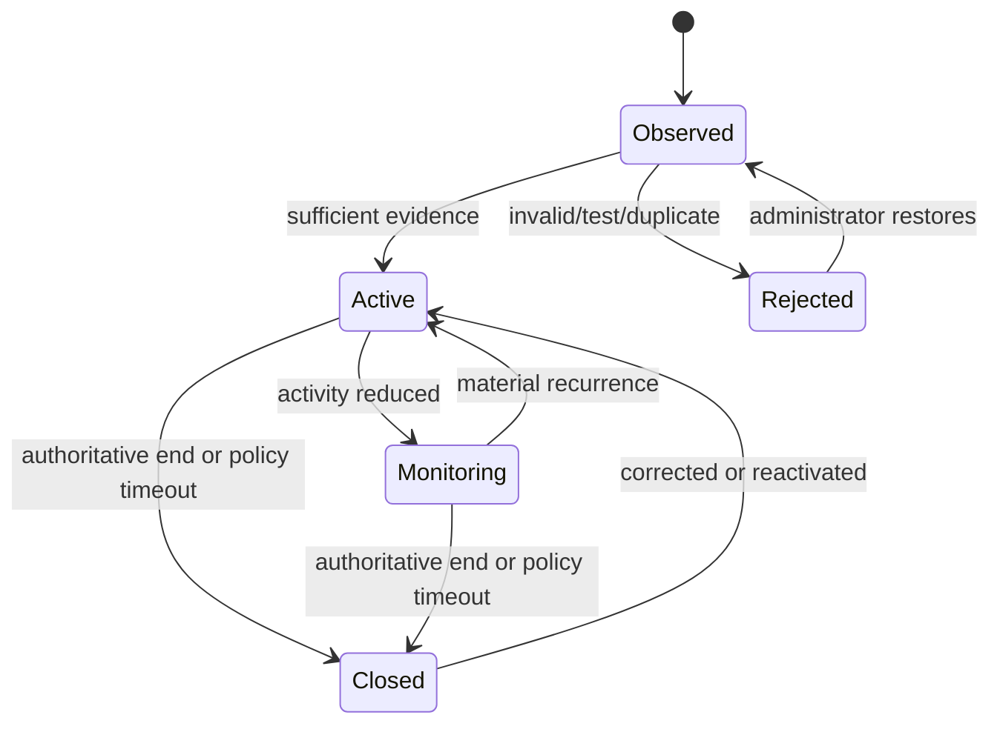

# Data model and event lifecycle

## Model goals

The model must preserve source truth, support replay, expose uncertainty, and allow an administrator to correct the public view without destroying evidence.

## Core tables

### Sources and collection

- `sources`: stable key, display name, source class, base URL, authority scope, license/terms URL, attribution, refresh policy, retention policy, enabled state, and configuration version.
- `source_runs`: start/end times, cursor, HTTP validators, item counts, outcome, error class, and snapshot freshness.
- `raw_artifacts`: optional compressed body or file reference, content hash, MIME type, retrieval time, retention deadline, and license decision.
- `observations`: stable source/external identity, event type, first/last seen, current version, source state, and deduplication keys.
- `observation_versions`: append-only normalized payload, source timestamps, retrieval timestamp, geometry, values with units, original URL, content hash, and parser version.

### Canonical events

- `events`: stable UUID/slug, type, lifecycle, canonical title, primary geometry, start/end times, public priority, confidence, verification status, publication state, current revision, and timestamps.
- `event_revisions`: append-only snapshot of canonical fields, reason, actor, and previous revision.
- `event_links`: event/observation association, relation type, correlation score, decision method, decision actor, and active state.
- `event_aliases`: stable source IDs, previous slugs, and explicitly linked identifiers.
- `event_geometries`: point, polygon, multipolygon, line/track, valid time, source, precision, and public visibility.
- `correlation_candidates`: proposed event pair/observation match, feature scores, threshold band, status, and review decision.

### Editorial data

- `articles`: canonical URL, headline, excerpt, publisher, published time, retrieved time, language, content hash, source tier, and rights/retention fields.
- `event_articles`: event link, relevance score, corroboration cluster, and review state.
- `timeline_entries`: event, occurred/published times, title, body, category, confidence, verification state, materiality, publication state, and revision.
- `citations`: timeline entry to exact observation version or article, including locator and support type.
- `reports`: event, current published version, draft version, and publication state.
- `report_versions`: structured sections, rendered text, generation method, model metadata if any, evidence-bundle hash, author/editor, as-of time, and publication time.
- `report_citations`: report version, section/paragraph locator, evidence reference, and support type.

### Operations and administration

- `jobs`: durable work queue and leases.
- `admin_users`, `sessions`, and `recovery_codes`: local administration identity.
- `review_items`: derived/actionable work with reason and status.
- `audit_log`: append-only command, actor, target, reason, before/after hashes, request ID, and time.
- `schema_metadata`: source taxonomy and scoring configuration versions used by a revision.

The MVP should remain below roughly 25 domain tables. New tables require a data-ownership review; generic entity-attribute-value models are not accepted.

## Important value distinctions

### Severity, priority, and confidence

- `source_severity` is what an upstream authority supplied.
- `public_priority` is the platform's deterministic ordering aid.
- `confidence` describes support for the canonical interpretation.
- `verification_status` describes editorial state.

They must never share one column or be silently converted into one another. Unknown values are nullable/explicit enums, not numeric zero.

### Time

Store separately:

- when the event occurred or is valid;
- when the source published or updated it;
- when the platform retrieved it;
- when an administrator verified it;
- when the platform published it.

All times are UTC with source timezone metadata preserved when parsing was ambiguous. Future timestamps outside a source-specific tolerance are quarantined.

### Geometry

Every geometry stores its source and precision. A geocoded city centroid is not represented as an affected polygon. Approximate and inferred geometries display differently from authoritative tracks or alert polygons.

## Correlation

Correlation is deterministic and event-type specific:

1. exact source alias or explicit upstream cross-reference;
2. normalized identifier match;
3. candidate retrieval by compatible type, time window, and PostGIS distance/intersection;
4. weighted score using distance, time, title/place similarity, magnitude/track consistency, and source relationship;
5. high-confidence auto-link, low-confidence new event, ambiguous review item.

Thresholds are versioned configuration. The score and features are stored. Manual merge and split operations are reversible, preserve aliases, and trigger read-model/report recalculation. No model call participates in the MVP correlation decision.

## Lifecycle

Source status and canonical lifecycle are separate. Closing requires an authoritative end signal or type-specific inactivity policy; a missing source response cannot close an event. Downgrades use hysteresis and require durable evidence. All transitions create event revisions.

## Publication workflow

Canonical data can exist before it is public. Publication states are `draft`, `in_review`, `published`, `withdrawn`, and `archived`. Public APIs only expose published revisions. Correcting a publication creates a new revision; it does not mutate the historical published representation in place.

## Retention

- Normalized observations, event revisions, citations, publications, and audit records: retained indefinitely unless a legal requirement says otherwise.
- Raw API/RSS/CAP payloads: retained when source terms allow, initially 90 days compressed.
- Copyrighted article bodies: not stored by default; keep metadata, a short permitted excerpt, hash, and original link.
- Fetch logs and successful job records: 30 days; aggregate health metrics longer.
- Failed payload fixtures containing no personal/sensitive data: promoted manually into a redacted test corpus.

Retention is enforced by a visible scheduled job and reported in system health.
