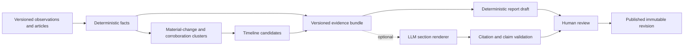

# Reports, timelines, and optional AI

## Evidence-first pipeline



The platform creates useful timelines and reports with no model credentials.

## Timeline construction

Every new observation version is diffed against the previous version using event-type materiality rules. Examples include magnitude revision, alert-level change, new authoritative casualty range, track change, new evacuation order, official closure, or significant response update.

The pipeline:

1. extract typed fact changes with before/after values and units;
2. suppress formatting-only or immaterial changes;
3. cluster corroborating observations within type-specific time windows;
4. retain conflicting values as a conflict candidate;
5. generate a concise timeline candidate with exact evidence links;
6. auto-publish only low-risk authoritative machine updates allowed by policy; otherwise queue review.

The event page defaults to meaningful changes and offers an expanded source history. A recurring unchanged feed item never becomes a new timeline entry.

## Report schema

A report is structured data before prose:

```json
{
  "asOf": "2026-07-31T12:00:00Z",
  "sections": {
    "overview": [],
    "currentSituation": [],
    "humanImpact": [],
    "infrastructureImpact": [],
    "response": [],
    "outlook": [],
    "unknowns": []
  }
}
```

Each array item contains a typed claim, value/range and unit where relevant, time validity, confidence, verification state, and evidence IDs. Deterministic templates turn this schema into concise prose. Missing sections render “No verified information available” rather than speculative filler.

## Optional model renderer

The model receives only the bounded evidence bundle, report schema, style rules, and existing section being revised. It cannot browse, call tools, change event state, or publish. It returns strict JSON with paragraph-level citation IDs.

Validation rejects:

- citation IDs not present in the bundle;
- uncited factual sentences;
- numeric values not grounded in a cited fact;
- unsupported life-safety instructions;
- altered units or time ranges;
- prose exceeding configured length;
- output failing the JSON schema.

Invalid output falls back to the deterministic draft and remains visible in admin diagnostics. The model response, provider, model identifier, prompt version, token counts, latency, and evidence hash are recorded with the draft.

## Provider interface

The backend uses a small internal interface rather than an agent framework:

```go
type ReportRenderer interface {
    Render(ctx context.Context, req RenderRequest) (RenderResult, error)
}
```

Implementations:

- `template`: default and always enabled;
- `ollama`: optional local OpenAI-compatible endpoint for operators with sufficient RAM;
- `openai-compatible`: optional remote endpoint with model allowlist, timeout, per-report token ceiling, and monthly budget.

There is no model router, tool protocol, vector store, or RAG framework in MVP.

## Cost and privacy posture

- Automatic model generation is disabled by default.
- Admin generation is per-event/per-section and explicitly requested.
- A daily/monthly hard request and token budget is enforced locally.
- Free API tiers may use submitted content for provider improvement; do not send sensitive operator notes or embargoed documents.
- Paid services must be configured so submitted data is not used for training where the provider offers that distinction.
- Local Ollama has no token fee but requires materially more memory/CPU; it is a deployment profile, not part of the core VPS sizing.

As one current example, the [Gemini Developer API](https://ai.google.dev/gemini-api/docs/pricing) offers limited free access for selected models, but free-tier content can be used to improve provider products. Pricing and data terms change, so the admin settings page links to the provider's current terms and never promises a permanent free tier.

## Editorial safeguards

- Published reports always show as-of time, editor/generation method, revision, and citations.
- Model-written content is labeled “AI-assisted and human-reviewed,” not “AI verified.”
- An administrator can compare evidence bundle, generated draft, edits, and publication.
- Corrections create a new public revision with a correction note.
- Emergency instructions are quoted and attributed only to an official authority.
- Approximate population exposure is labeled as a model estimate and never becomes a casualty figure.

## Evaluation

Maintain a redacted golden set spanning event types, sparse evidence, conflicting figures, source outages, corrections, and multilingual sources. Evaluate deterministic and model renderers for factual consistency, citation validity, omission of unknowns, update sensitivity, readability, and harmful instruction generation. A model/version cannot be enabled by default until it passes the same acceptance thresholds as the previous default.
