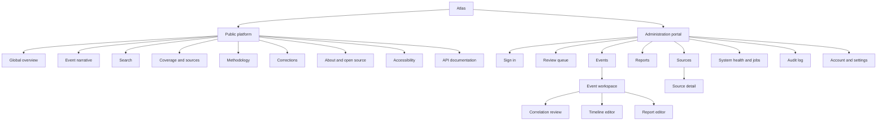

# Atlas product design brief

## Purpose

This brief gives product designers enough context to redesign the complete Atlas
public platform and administration portal. It defines each page's purpose,
intended user outcome, required capabilities, important flows, and states that
must be considered. It deliberately does not prescribe layouts, visual
compositions, or a finished art direction.

The current application contains a working public overview and administration
foundation. Designers should consider the intended end-to-end MVP rather than be
constrained by the current route shells.

## Product intent

Atlas is an open-source global disaster-monitoring platform by Prabhava Labs. It
helps people answer four questions:

1. Which significant disasters are active?
2. What is known, when was it last verified, and by whom?
3. What changed during the event?
4. Where can the original evidence be inspected?

Atlas combines official alerts, humanitarian reports, and carefully selected
news into a coherent event record. It is a monitoring and synthesis product, not
an emergency authority. Public visitors must always be directed to the relevant
local authority for life-safety decisions.

## Audiences

### Public monitor

Journalists, researchers, humanitarian workers, community organizations, and
members of the public need a fast global overview with no account or setup. They
care about freshness, provenance, uncertainty, meaningful changes, and a clear
event history more than a large number of controls.

### Editorial user

Trusted viewers, editors, and administrators need to inspect evidence, resolve
ambiguous events, edit timelines and reports, publish verified information, and
correct mistakes without losing history. The portal should reduce review effort
without hiding consequential decisions behind automation.

### Self-hosting maintainer

An open-source operator needs to understand source health, jobs, resource use,
backups, configuration, and failures without becoming a distributed-systems
expert. Operational pages should translate technical state into clear impact and
safe actions.

## Experience principles

- **Public reading is account-free.** No public journey should encounter a login
  wall or account prompt.
- **Evidence comes before prose.** Claims, reports, and timeline updates remain
  visibly connected to their sources.
- **Freshness is explicit.** “Last checked,” “last changed,” and “last verified”
  mean different things.
- **Unknown is not zero.** Missing, conflicting, preliminary, predicted, and
  estimated values require honest labels.
- **The map supports the story.** Every spatial view has a useful list and text
  equivalent.
- **Automation proposes; people publish.** Generated or inferred content remains
  a draft until reviewed, and material actions are auditable.
- **Degraded is better than blank.** Last-known-good information stays visible
  with stale or partial-coverage context during upstream failures.
- **Trust over alarm.** The experience should be calm, precise, readable under
  pressure, and careful with hazard colours.
- **Complexity must be earned.** Workflows and configuration must remain
  understandable for a primarily single-maintainer project.

## Component foundation

The frontend uses **shadcn/ui** with React, Vite, Tailwind CSS, TanStack Router,
TanStack Query, Zustand, and MapLibre. Designs should align with shadcn/ui
components, composition patterns, accessibility conventions, and interaction
behaviour wherever practical.

Designers may extend or compose shadcn/ui primitives, but should avoid creating a
parallel component language when an existing primitive expresses the
interaction. A complex editorial workspace may compose several primitives
rather than force all content into cards.

## Information architecture

Route names are working recommendations, not a constraint on visual design.

## Complete page inventory

| Area | Page | Suggested route | Priority | Access |
| --- | --- | --- | --- | --- |
| Public | Global overview | `/` | Core MVP | Anyone |
| Public | Event narrative | `/events/:slug` | Core MVP | Anyone |
| Public | Search results | `/search` | Core MVP | Anyone |
| Public | Coverage and source status | `/coverage` | Core MVP | Anyone |
| Public | Methodology | `/methodology` | Core MVP | Anyone |
| Public | Corrections and revision policy | `/corrections` | Supporting MVP | Anyone |
| Public | About and open-source project | `/about` | Supporting MVP | Anyone |
| Public | Accessibility statement | `/accessibility` | Supporting MVP | Anyone |
| Public | Public API documentation | `/developers/api` | Supporting MVP | Anyone |
| Public | Privacy, terms, attribution, and disclaimer | Footer or dedicated routes | Launch requirement | Anyone |
| System | Not found, withdrawn, superseded, unavailable | Route-level states | Launch requirement | Anyone |
| Admin | Sign in | `/admin/login` or protected entry | Foundation | Anonymous admin user |
| Admin | Review queue | `/admin` | Core MVP | Viewer, editor, administrator |
| Admin | Events index | `/admin/events` | Core MVP | Viewer, editor, administrator |
| Admin | Event workspace | `/admin/events/:id` | Core MVP | Viewer, editor, administrator |
| Admin | Correlation merge/split review | Workspace route or mode | Core MVP | Editor, administrator |
| Admin | Timeline editor | Workspace route or mode | Core MVP | Editor, administrator |
| Admin | Reports index | `/admin/reports` | Core MVP | Viewer, editor, administrator |
| Admin | Report editor and public preview | `/admin/reports/:id` | Core MVP | Viewer, editor, administrator |
| Admin | Sources index | `/admin/sources` | Core MVP | Viewer, editor, administrator |
| Admin | Source detail and run history | `/admin/sources/:id` | Core MVP | Viewer, editor, administrator |
| Admin | System health and jobs | `/admin/health` | Core MVP | Viewer; actions restricted |
| Admin | Audit log and detail | `/admin/audit` | Core MVP | Role-filtered |
| Admin | Account and security | `/admin/settings/account` | Supporting MVP | Signed-in user |
| Admin | Installation settings | `/admin/settings` | Supporting/later | Administrator |
| Admin | AI provider and budget settings | `/admin/settings/ai` | Deferred Phase 6 | Administrator |

Privacy, terms, attribution, and disclaimer content may be combined into fewer
pages after legal review. They must remain easy to find even if they are not
separate routes.

## Public platform pages

### 1. Global overview

**Purpose:** Help a visitor understand the most significant active disasters and
move quickly from a global scan to a specific event.

**Experience intention:** The page should be useful within seconds, including on
mobile, slow connections, or when the map cannot load. The list and map represent
the same event set and selection. Ranking reflects verified significance and
recency of meaningful change, not news volume.

**Key functionality:** active-event list; synchronized world map; filters for
disaster type, priority, lifecycle, time, and region; search entry; shareable URL
state; last-updated context; coverage warning when degraded; mobile list-first
behaviour; and navigation to the full event narrative.

**Important states:** first load, cached refresh, no published incidents, no
filter matches, stale data, partial source outage, total upstream outage with
cached data, map/tile/WebGL failure, and API failure with retry.

### 2. Event narrative

**Purpose:** Present the complete, understandable, source-backed story of one
disaster from its beginning through the current situation.

**Experience intention:** This should read as one anchored narrative rather than
a dashboard or collection of tabs. Visitors should distinguish verified facts,
source-reported values, uncertainty, automated estimates, editorial summaries,
and unknowns.

**Key functionality:** event identity and status; “what we know” facts with
inline citations; structured situation report; event geometry with text
equivalent; material-change timeline; official updates, humanitarian reports,
and selected news; source freshness and limitations; methodology; report
revision history; shareable anchors; and links to original evidence.

**Important states:** preliminary, automatic, manually verified, conflicting
figures, unknown impact, approximate geometry, corrected report, withdrawn event,
superseded slug, stale evidence, missing section, and unavailable source link.

### 3. Search results

**Purpose:** Help visitors locate an event or update using a place, event type,
phrase, source headline, or approximate spelling.

**Experience intention:** Search should explain why each result matched. Ordinary
full-text and typo-tolerant search is preferred over opaque semantic ranking.

**Key functionality:** query and reset; event, timeline, report, and article
results; result type and matched-field labels; safe excerpts; filters, sort, and
bounded pagination; shareable query URL; and links to the relevant event section.

**Important states:** initial search, short/invalid query, no results, typo match,
cached results, loading more, partial failure, and unavailable result.

### 4. Coverage and source status

**Purpose:** Explain what Atlas monitors, where its information comes from, and
which coverage is degraded.

**Experience intention:** A visitor must not interpret “no event displayed” as
proof that a location is safe or fully monitored. Status should use reader
language rather than backend terminology.

**Key functionality:** source hazard/geographic scope, authority type, expected
cadence, freshness and last success, known coverage gaps, current outages,
last-known-good behaviour, attribution, terms, and source limitations.

**Important states:** healthy, partial outage, stale, never configured, regional
gap, full external outage, and recovery.

### 5. Methodology

**Purpose:** Explain aggregation, correlation, priority, confidence, timeline,
report, AI, and publication rules.

**Experience intention:** This is a public trust page, not only technical
documentation. Readers should understand what Atlas does, what it does not know,
and why a label or ranking appears.

**Key functionality:** source hierarchy; severity/priority/confidence/lifecycle
definitions; event correlation; freshness and last-known-good rules; report and
timeline construction; optional AI policy; map/geocoding/exposure uncertainty;
limitations; and emergency-authority disclaimer.

### 6. Corrections and revision policy

**Purpose:** Explain how errors, retractions, corrections, unpublishing, and
removal requests are handled.

**Experience intention:** Corrections should increase trust rather than silently
replace history.

**Key functionality:** correction principles, public revision behaviour,
withdrawal states, contact path, response process, and links to affected event
revision histories.

### 7. About and open source

**Purpose:** Introduce Atlas's mission, Prabhava Labs stewardship, open-source
model, product boundaries, and contribution paths.

**Experience intention:** Encourage confidence and participation without turning
the monitoring experience into marketing.

**Key functionality:** mission, intended users, repository/license,
contribution/security links, maintainership, cost-conscious philosophy, and the
statement that Atlas is not an emergency authority.

### 8. Accessibility statement

**Purpose:** State the accessibility target, known limitations, contact route,
and review date.

**Experience intention:** Treat accessibility as an operational commitment with
transparent known issues, not a generic compliance claim.

### 9. Public API documentation

**Purpose:** Help developers and self-hosters use the stable public API without
exposing administrative or internal endpoints.

**Experience intention:** Generated OpenAPI reference may be linked, but the page
should explain anonymous reads, caching, pagination, rate limits, geometry
bounds, versioning, attribution, and acceptable use in plain language.

## Administration portal pages

### 1. Sign in

**Purpose:** Give authorized users secure access with minimal friction.

**Experience intention:** Quiet and focused, without resembling public
registration or account acquisition.

**Key functionality:** email, password, password-manager support, rate-limit
feedback, session-expiry explanation, and return to the requested protected page.
Public sign-up and account creation are absent.

**Important states:** invalid credentials, rate limit, expired session,
signed-out confirmation, server unavailable, and recoverable unsaved draft after
re-authentication.

### 2. Review queue

**Purpose:** Show what needs attention, why, and the safest next action.

**Experience intention:** This is the administration home. Work is grouped by
human reason: possible duplicate, new high-priority event, material source
change, conflicting figures, report draft, stale source, failed job, or
correction request.

**Key functionality:** priority/age ordering, reason filters, counts, source
context, target summary, recommended action, assignment/local labels if needed,
dismiss/resolve with reason, and preserved queue position. Bulk publishing is
intentionally absent.

**Important states:** empty queue, high volume, stale data, target changed,
permission-limited action, resolved elsewhere, and live updates that do not move
keyboard focus.

### 3. Events index

**Purpose:** Find canonical events across draft, active, ended, corrected,
withdrawn, and unpublished states.

**Experience intention:** An operational catalog, not a copy of the public
overview. Editorial state, source health, revision, and review work should be easy
to scan.

**Key functionality:** search, bounded filters, state/ownership, latest material
change, revision, publication state, source count, validation issues, and links
to workspace/public page.

### 4. Event workspace

**Purpose:** Understand evidence, maintain the canonical event, edit its public
story, and control publication in one connected workspace.

**Experience intention:** Evidence/source history, canonical facts/timeline, and
publication status remain connected. Smaller screens may sequence these areas
without losing context.

**Key functionality:** evidence/version diffs; canonical facts, location,
geometry, lifecycle, priority, and confidence; source values beside chosen
values; link/unlink/suppress evidence; reviewed manual source URL; correlation
explanation; timeline and report editing; validation blockers; public preview;
publish/unpublish/correct/withdraw; unsaved-change protection; revision-conflict
recovery; required reasons; and audit links.

**Important states:** new/unpublished, valid draft, blocked publication,
conflicting evidence, suppressed evidence invalidating content, concurrent edit,
correction required, read-only role, stale source, and partial workspace load.

### 5. Correlation merge/split review

**Purpose:** Decide whether observations describe the same event and repair an
incorrect grouping safely.

**Experience intention:** The decision should be explainable, not reduced to one
probability score. Spatial, temporal, event-type, title, and source differences
need side-by-side comparison.

**Key functionality:** merge, keep separate, split observations, downstream
impact preview, undo unpublished merge where safe, required reason, revision
conflict handling, and audit result.

### 6. Timeline editor

**Purpose:** Turn meaningful evidence changes into a concise, cited event history.

**Experience intention:** Distinguish candidate, draft, published entry,
correction, conflict, and rejected change. Routine unchanged polling must not
overwhelm the timeline.

**Key functionality:** accept/edit/reject candidate; manual entry; occurred and
published times; category/materiality; event-linked citations; public preview;
and revision history. Factual entries without citations cannot be published.

### 7. Reports index

**Purpose:** Show report drafts and revisions needing work across all events.

**Experience intention:** Status, evidence freshness, review requirement,
publication state, and age matter more than generated prose volume.

**Key functionality:** search/filters, event link, report status, as-of time,
evidence revision/hash, generation method, reviewer if used, validation issues,
and links to editor/public revision.

### 8. Report editor and preview

**Purpose:** Maintain a concise, structured, fully cited situation report.

**Experience intention:** The report is structured evidence before prose.
Paragraph-level support and unknown/conflicting information remain visible.
Optional generation assists one section at a time and never publishes.

**Key functionality:** section navigation, deterministic initial draft, direct
editing, evidence inspector, citations, unknown/conflict validation, revision
comparison, public preview, publish/correct, and optional section generation with
provider/model/privacy/budget context.

**Important states:** no report, deterministic draft, human-edited draft,
AI-assisted draft awaiting review, invalid citations, evidence changed, budget
exceeded, provider unavailable with deterministic fallback, concurrent edit, and
published revision requiring correction.

### 9. Sources index

**Purpose:** Show whether each configured source is delivering usable, fresh
coverage.

**Experience intention:** Translate adapter health into coverage impact and safe
operator actions; raw logs are not the primary experience.

**Key functionality:** scope, enabled state, freshness, last success/change,
expected cadence, error streak/class, next retry, item counts, coverage impact,
run now, and source-detail navigation. State changes require role and audit reason.

### 10. Source detail and run history

**Purpose:** Diagnose one source and recover it safely.

**Experience intention:** A solo maintainer should be able to distinguish an
upstream, configuration, parsing, rate-limit, or processing problem without
exposing secrets or unsafe raw content.

**Key functionality:** authority/scope/terms, cadence, health, run history,
bounded errors, breaker/backoff, counts, adapter version, run now,
enable/disable, reset breaker, and affected review items. There is no shell or
arbitrary job-payload editor.

### 11. System health and jobs

**Purpose:** Show whether Atlas can ingest, store, serve, back up, and recover its
data.

**Experience intention:** Lead with user impact and recovery action. Healthy
components should not bury meaningful warnings.

**Key functionality:** application/database state, storage, schema/app version,
queued/retrying/poison jobs, backup recency, restore-test age, source summary,
resource thresholds, and bounded retry actions. Secrets and raw bodies are never
shown.

### 12. Audit log

**Purpose:** Provide an immutable, searchable explanation of consequential
changes and their actor.

**Experience intention:** Support accountability and incident review without
exposing secrets or unnecessary personal data.

**Key functionality:** actor/action/target/time filters, change summary, reason,
bounded before/after detail, target/revision links, pagination, and bounded
export. Entries cannot be edited or deleted through the product.

### 13. Account and installation settings

**Purpose:** Manage personal security and the small set of installation
preferences that genuinely need a UI.

**Experience intention:** Keep settings intentionally small. Configuration safer
in deployment files should not be copied into the portal for convenience.

**Key functionality:** account identity/role, password change, active-session
revocation, future TOTP/WebAuthn, public URLs/time display, source configuration
links, and version. Complex organization and role management is deferred.

Optional AI settings are a later area for endpoint/model allowlist, privacy
policy, request/token ceilings, monthly budget, usage, and a test action. Adding
credentials must not automatically enable generation.

## Important end-to-end flows

### Public flows

1. **Discover an event:** overview → filter or scan list/map → select event →
   open narrative.
2. **Investigate a claim:** event → report/fact → citation → original source →
   return to the same claim.
3. **Understand changes:** revisit/shared event → latest material update → expand
   earlier timeline/history.
4. **Find a known event:** search place/title/phrase → understand match reason →
   open the relevant section.
5. **Share a view:** apply filters → copy URL → recipient sees the same context
   without an account.
6. **Handle degraded coverage:** see stale/partial notice → keep using
   last-known-good data → inspect affected coverage → retry later.
7. **Follow a correction:** correction/withdrawal label → revision explanation →
   preserved evidence and current state.

### Editorial flows

1. **Authenticate and resume:** request protected route → sign in → return to it;
   after expiry, re-authenticate without losing a recoverable draft.
2. **Triage review work:** queue → filter by reason → inspect explanation → open
   target → complete/dismiss with reason → return to queue position.
3. **Resolve correlation:** compare observations → merge/keep separate/split →
   preview effects → confirm with reason → inspect audit.
4. **Maintain an event:** review evidence changes → update canonical fields →
   link/suppress evidence → resolve validation.
5. **Publish a timeline update:** review candidate → edit → attach citations →
   preview → publish through the event workflow.
6. **Prepare a report:** deterministic draft → edit sections → inspect evidence →
   optionally generate one section → validate → preview.
7. **Publish an event revision:** resolve blockers → compare public preview →
   enter reason → publish → verify public page → inspect audit.
8. **Correct or withdraw:** identify error → select policy → explain publicly →
   publish new revision → preserve history and URL behaviour.
9. **Recover a source:** source warning → run/error detail → retry/reset safely →
   confirm recovery → resolve queue item.
10. **Handle concurrent work:** stale mutation → compare server changes → copy or
    reconcile local work → reload → retry intentionally; never overwrite silently.

### Cross-interface publication loop

Editors must be able to move from an administration preview to the exact public
representation and back. Drafts, raw evidence, audit data, and administrator
identity must never leak into the public response.

## Roles and permission behaviour

- **Viewer:** read-only administration monitoring and auditing.
- **Editor:** review evidence and edit events, timelines, and reports; may request
  optional generation when enabled.
- **Administrator:** editor abilities plus publication, source operations,
  installation settings, and other high-impact controls.

Unavailable actions should be deliberately absent, disabled with an explanation,
or visible in a read-only preview. A server-side denial must remain understandable
even when the interface expected permission.

## State matrix for design coverage

| State family | States to cover |
| --- | --- |
| Loading | First load, stable skeleton, cached refresh, pagination/load more |
| Empty | No active incidents, no filter/search match, empty queue, source never configured, no report |
| Freshness | Current, refreshing, stale, partial outage, full outage with cached data, recovered |
| Verification | Automatic, preliminary, predicted, confirmed, manually verified, unknown, conflicting, estimated |
| Publication | Unpublished, draft, blocked, ready, publishing, published, corrected, withdrawn, superseded |
| Mutation | Unsaved, saving, saved, failed, retryable, confirmation, reason required, partially invalid |
| Security | Signed out, invalid credentials, rate limited, expired session, permission denied, CSRF/session failure |
| Concurrency | Target changed, revision conflict, resolved elsewhere, reload/reconcile path |
| Map | Loading style, no/approximate geometry, tile failure, WebGL failure, text/list fallback |
| Network | Offline/unreachable, slow response, API error, source unavailable, cached last-known-good |
| Navigation | Not found, old-slug redirect, withdrawn resource, deep link, restored filters/scroll/focus |
| Accessibility | Keyboard focus, screen reader order, 200% zoom, reduced motion, high contrast, dark theme |
| Responsive | Wide desktop, constrained laptop, tablet, mobile, long/localization-ready content |

## Interaction guidelines

### Navigation and URL state

- Public filters, search, and meaningful anchors are shareable and survive
  reload/back/forward.
- Public and administration shells remain structurally separate.
- Route changes restore focus and preserve useful list/queue position.
- Event narratives use anchored sections rather than hiding content behind tabs.

### Maps

- List and map share one selection and filter state.
- Maps use cooperative gestures and never trap keyboard/page scrolling.
- Selecting a marker and its list row have equivalent outcomes.
- Mobile is list-first; closing the map restores selection and list position.
- Attribution remains visible and geometry has a textual equivalent.

### Forms and mutations

- Use explicit labels, inline validation, and stable error messages.
- Preserve unsaved work across recoverable failure or session expiry where safe.
- Publication and evidence mutations wait for server confirmation.
- Destructive/public actions state consequences and require a meaningful reason;
  harmless actions should not gain unnecessary confirmation dialogs.
- Focus returns to the initiating control after dialogs and sheets close.

### Feedback and status

- Toasts supplement feedback; important errors/blockers remain near the content.
- Colour is never the sole indicator of severity, confidence, freshness, or state.
- Exact timestamps with UTC are available; relative time is supplementary.
- Live updates do not reorder the item currently under keyboard focus.

### Content density

- Public pages optimize for comprehension and progressive disclosure.
- Administration pages may be denser but keep decision, evidence, and consequence
  visible.
- Tables become labelled stacked rows or another semantic narrow-screen pattern,
  not horizontal-scroll traps.
- Unknown, conflict, citation, and correction context cannot depend on tooltips.

## shadcn/ui alignment

| Product need | shadcn/ui foundation |
| --- | --- |
| Public/admin navigation | Navigation Menu, Sidebar, Breadcrumb, Dropdown Menu |
| Search and filters | Input, Command, Select, Popover, Checkbox, Radio Group, Sheet/Drawer |
| Event/status metadata | Badge, Tooltip for supplementary help, Separator |
| Operational lists | Table/Data Table patterns, Pagination, Scroll Area where appropriate |
| Narrative disclosure | Accordion, Collapsible; Tabs only for non-linear admin tools |
| Forms and validation | Form, Field, Label, Input, Textarea, Select |
| Confirmation/reasons | Dialog, Alert Dialog, Textarea |
| Mobile map and filters | Sheet or Drawer |
| Workspace composition | Resizable panels, Sidebar, task-appropriate Tabs/Accordion |
| Loading and progress | Skeleton, Progress, Spinner patterns |
| Feedback | Alert, Sonner/Toast for transient confirmation |
| Dates/bounded selection | Calendar, Date Picker, Select |
| Supplementary definitions | Hover Card or Tooltip only for non-essential information |

shadcn/ui provides primitives rather than product semantics. Atlas still needs
documented variants for hazard, confidence, verification, freshness,
publication, and source-health states, with text/icon support and accessible
names.

## Accessibility and resilience requirements

- WCAG 2.2 AA is the minimum target.
- Core flows work with keyboard only and at 200% zoom.
- Focus is visible, logical, and restored after overlays/routes.
- Touch targets are at least 44 by 44 CSS pixels on touch layouts.
- Timelines, dates, tables, filters, and map alternatives use semantic markup.
- Motion explains state change, respects reduced motion, and is never essential.
- Verified content remains understandable when maps, tiles, sources, optional
  AI, or individual requests fail.
- Designs tolerate longer translated text even though English is the MVP language.

## Content guidelines

- Use factual, concise, source-aware language.
- Prefer “reported,” “confirmed,” “estimated,” “last checked,” and “last
  verified” over vague certainty or urgency.
- Never issue safety instructions in Atlas's own voice; quote and attribute an
  official authority when relevant.
- Do not imply that missing impact data means no impact.
- Label AI-assisted text as a draft before review and “AI-assisted and
  human-reviewed” after publication.
- Preserve correction and conflict context instead of silently normalizing it.
- Display dates, numbers, units, locations, and source names consistently.

## Expected design deliverables

The redesign package should ultimately include:

1. agreed information architecture and navigation;
2. responsive designs for every core page and representative supporting pages;
3. public and administration shell patterns;
4. reusable shadcn/ui-aligned components and semantic variants;
5. desktop/mobile designs for the critical flows;
6. loading, empty, stale, outage, error, conflict, correction, and permission
   examples—not only ideal states;
7. interaction notes for list/map sync, filters, citations, review, publication,
   and conflict recovery;
8. accessibility annotations for focus, landmarks, labels, announcements, map
   alternatives, and narrow-screen tables; and
9. realistic disaster, evidence, timeline, report, source-health, and audit data.

## Recommended design sequence

1. Confirm public and administration information architecture.
2. Establish shared content, status, timestamp, citation, and navigation patterns.
3. Design global overview and event narrative together.
4. Design review queue and event workspace together.
5. Extend patterns to search, reports, sources, health, and audit.
6. Add supporting trust pages and account/settings surfaces.
7. Complete state matrix, responsive variants, and accessibility annotations.
8. Prototype public discovery-to-evidence and admin
   review-to-publish-to-correct flows before implementation.

## Explicit non-goals

- public accounts, subscriptions, or personalized dashboards;
- configurable dashboard widgets;
- a general-purpose GIS workbench;
- incident-response team, deployment, or contact management;
- chat, autonomous agents, RAG, embeddings, or generic browser research;
- social-media engagement feeds or automatic posting;
- bulk publishing;
- complex multi-organization administration; and
- native mobile or desktop applications.

These exclusions keep the redesign centered on trustworthy public monitoring and
a small, auditable editorial workflow.
